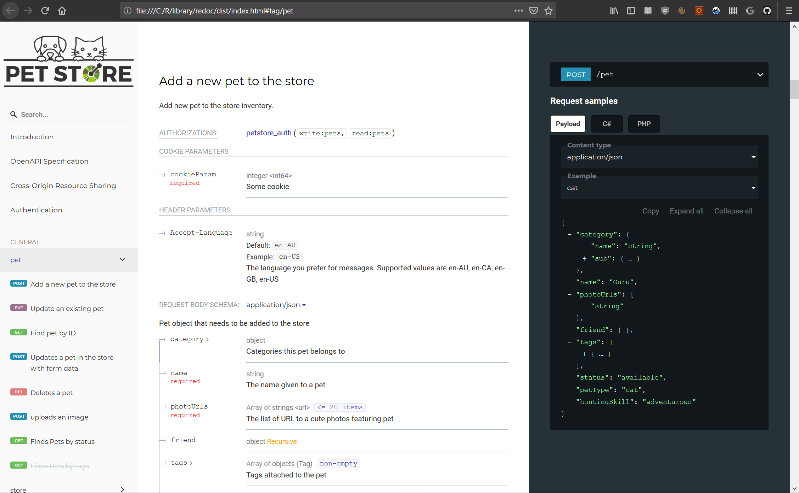

Generates `Redoc` documentation from an OAS Compliant API
================

<!-- badges: start -->

[](https://cran.r-project.org/package=redoc)
[](https://github.com/meztez/redoc/actions)
[](https://community.rstudio.com/tag/plumber)
<!-- badges: end -->

`redoc` is a collection of `HTML`, `JavaScript`, `CSS` and fonts assets
that generate `Redoc` documentation from an OpenAPI Specification.

The main purpose of this package is to enable package authors to create
APIs that are compatible with [redoc.ly](https://redoc.ly/redoc/) and
[openapis.org](https://www.openapis.org/).

Package authors providing web interfaces can serve the static files from
`redoc_path()` using [httpuv](https://github.com/rstudio/httpuv) or
[fiery](https://github.com/thomasp85/fiery). As a start, we can also
browse them by running

``` r
library(redoc)
browseURL(redoc_index())
```



## Installation

``` r
remotes::install_github("https://github.com/meztez/redoc")
```

## Use with `plumber` R package

### `plumber` annotation syntax

``` r
library(redoc)

#* @plumber
function(pr) {
  pr$setDocs("redoc", theme = list(menu = list(backgroundColor = "#00DE9C")))
}

#* @get /hello
function() {
  "hello"
}
```

### `plumber` programmatic usage

``` r
library(plumber)
library(redoc)
pr() %>%
  pr_get("hello", function() {"hello"}) %>%
  pr_set_docs("redoc", theme = list(menu = list(backgroundColor = "#00DE9C"))) %>%
  pr_run()
```

### Using `Redoc` API attributes

Further customize `Redoc` using its configuration object. Use nested
named list for nested configuration options.

``` r
pr()$setDocs("redoc", theme = list(menu = list(backgroundColor = "#00DE9C")), disableSearch = TRUE)

pr() %>% pr_set_docs("rapidoc", theme = list(menu = list(backgroundColor = "#00DE9C")), disableSearch = TRUE)
```

The full set of `Redoc` configuration options is supported.

To learn more about `Redoc` visit:

-   [Redoc](https://redoc.ly/redoc/)
-   [Redoc configuration
    options](https://github.com/Redocly/redoc#redoc-options-object)
